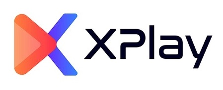

# XPlay

XPlay is a platform to watch interactive movies and enjoy watch parties across friends.

It is designed to attract various users from the video game and movie industry. XPlay is a platform where one or more viewers can interact with the film and influence the events that unfold in the film.

XPlay allows users to watch interactive movies on Smart Devices, with ease.

## Table of Contents
1. [Demo](#demo)
2. [Installation](#installation)
3. [Technology Stack](#technology-stack)
4. [Authors](#authors)
5. [Licence](#licence)

## Demo

[XPlay - Watch interactive movies](https://p3-xplay.netlify.app/home)

#### Guest Login -

guest@xplay.com : Secure123

## Installation

This project has a React JS frontend located here - https://github.com/pesto-students/xplay--frontend-team1_sai-chaitanya

Running this project locally is very easy and quick, just follow the below steps -

In the project directory, you can run:

### `yarn install`

Installs the required dependencies

### `yarn start`

Runs the app in the development mode.\
Open [http://localhost:8080](http://localhost:8080) to check the server health in your browser.

### `yarn test`

Launches the test runner in the interactive watch mode.\

Your APIs are ready to get called!

**_NOTE: Please checkout develop branch to run locally._**

### System Requirements

Following system requirements need to be met in order for this application to run -

- Node.js v16.0 or later

- Any common desktop OS including MacOS, Windows, and Linux is supported

### Environment

Following environment variables need to be set for the application to run -

- `OKTA_API_TOKEN`: API token to call the Okta APIs

- `OKTA_CLIENT_ID`: Client ID of an Okta App

- `OKTA_ISSUER`: Issuer URL generated for an Okta App

- `OKTA_ORG_URL`: Org URL generated for an Okta App

- `MONGO_URL`: A Mongo DB connection URL

- `SENTRY_DSN`: A Sentry DSN for error logging

**_NOTE: .env-sample in project root also has complete list of environment variables used._**

<!-- ## Designs

### HLD:

- [XPlay HLD on Miro](https://miro.com/app/board/uXjVPI_6KK8=/)

### PRD:

- [XPlay PRD on Slite](https://tusharwalzade.slite.page/p/OfXnNzLq0T3ct2/XPlay-PRD)

### Wireframes:

- [XPlay Wireframes for Desktop - Figma](https://www.figma.com/file/n1vnT5S3d5UBiqxmmzrP4B/XPlay?node-id=0%3A1)

- [XPlay Wireframes for Mobile - Figma](https://www.figma.com/file/n1vnT5S3d5UBiqxmmzrP4B/XPlay?node-id=228%3A390) -->

## Technology Stack

-   Backend - NodeJS, Express, Socket.io

-   Deployment - Vercel, CI/CD

-   Database - Mongo DB

-   JWT Verifier - Okta

-   Logging - Sentry

-   Tools - Version Control System (GIT), Github

## Authors

- [Tushar Walzade](https://github.com/tusharwalzade216)

- [Suresh Kumar](https://github.com/sureshmaverick)

Credits/ Guidence

-   [Sai Chaitanya Ramineni](https://github.com/sairamin)

## License

This project is developed under [MIT License](LICENSE.txt)
